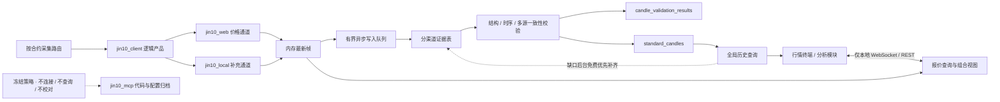

# 架构设计

## 目标

同一种数据允许由不同数据源提供，但实时数据与历史数据分开治理。每个合约独立绑定一个明确的实时来源，驱动报价、当前柱、分时、状态和延迟；历史 K 线是全局统一的数据集，只从本地 PostgreSQL 读取，缺口由后台按免费通道优先补齐。

## 实时性第一原则

- 准确性是前置门槛：只接收带明确品种、来源时间和本地接收时间的结构化数据，不用截图、OCR 或推测值补齐。
- 推送源的数据帧一旦完成校验和领域映射，必须在同一事件循环轮次内广播；数据库写入通过有界队列异步完成，不能阻塞页面。
- 实时报价查询和 WebSocket 首帧只读内存热缓存或 PostgreSQL `latest_quotes`，不得因页面打开、刷新或新增订阅者而调用上游。
- 采集生命周期只由合约路由决定。当前活动来源只有推送通道，并按实际合约集合订阅；MCP 请求式适配器冻结且不创建客户端。
- 上游推送间隔、网络往返和官方额度属于外部约束，必须单独展示；不得再叠加保守轮询、批次串行、长重连退避或全量重复绘图。

## 分层

1. `domain`：品种、报价、K线、快讯、文章、财经事件和来源元数据。不得依赖网络库或提供方字段。
2. `application`：按能力拆分的数据端口、显式来源校验、按合约采集路由、只读报价视图和持续报价事件。
3. `infrastructure.mcp`：历史实现归档；当前由 `JIN10_MCP_ENABLED=false` 冻结，运行时不实例化客户端。
4. `application.sources`：校验实时来源；另行提供历史质量顺序和免费优先补缺顺序，两者不读取合约实时路由。
5. `infrastructure.providers.jin10`：代码映射、金十结构化结果校验与领域对象转换。
6. `infrastructure.postgres`：来源路由、分渠道报价追加、最新值原子更新、候选 K 线、校验审计和标准历史。
7. `infrastructure.providers.jin10_local`：本机会话解析、行情协议、长连接、心跳与断线重连。
8. `infrastructure.providers.jin10_web`：官网公开报价协议、变化驱动订阅、心跳响应和快速重连。
9. `web`：按合约连接本地 API/WebSocket，不持有 Bearer Token 或本地会话令牌；同秒多帧以接收时间保持顺序并全部参与当前柱计算。
10. `analysis`：未来的指标、特征、信号和回测。只消费领域对象。

## 多数据源约束

- 用领域品种标识表达资产，提供方代码由各适配器映射。
- 每条记录保留 `provider`、`provider_symbol`、源时间和本地接收时间。
- `instrument_source_routes` 暂保留旧表结构以兼容现有数据库；当前只把 `quote` 行作为合约实时来源。旧 `candles` 行不再参与历史读取。
- 实时层拒绝 `auto`；来源不可用时只停滞绑定它的合约，不静默换源。
- 原始层严禁混合渠道：活动通道 `jin10_web` 与 `jin10_local` 各自追加、缓存和审计。历史遗留的 `jin10_mcp` 原始记录只作审计归档，不进入实时、校对或标准历史；`jin10_client` 只是查询/展示层的逻辑产品，不写入原始行情表。
- 组合字段归属固定：`last/change/change_percent` 只能来自 `jin10_web`；`open/high/low/volume` 只能来自 `jin10_local`。价格通道失败时组合报价停滞，补充通道失败时字段标记缺失或过期，均不静默代替。
- 历史层对所有合约和订阅者返回同一套 `standard_candles`。候选记录先通过领域结构与时序校验；同分钟多源候选的收盘偏差不超过阈值才以 `cross_source_consensus` 接受，单源候选以 `single_source_structural` 标记。接受/拒绝及全部候选写入 `candle_validation_results`。
- 历史 API 不访问上游。它只在本地把已落库候选推进验收层；仍有缺口时另行调度后台补齐，接口结果继续只来自本地标准表。
- 启动时删除所有含 `jin10_mcp` 候选证据的 `standard_candles` 与 `candle_validation_results`；历史查询还会按当前允许来源二次过滤，防止旧记录回流。
- 报价先进入内存事件通道，数据库通过有界队列异步落盘。
- `jin10_local` 与 `jin10_web` 都是独立事件推送渠道。`jin10_mcp` 的请求式能力代码保留但当前全面冻结：不可启用、不可选为合约路由、不可测试，也不参与历史补缺或校对。
- 原始响应可用于审计，但不能成为跨模块契约。

## 首版范围

- `jin10_client` 是首个显式组合产品；`jin10_local` 与 `jin10_web` 同时作为可审计原始通道保留。每个合约独立选择活动产品/渠道，不做实时静默换源。`jin10_mcp` 暂不属于可选数据源。历史标准序列仅从允许的非 MCP 候选证据中校验生成，缺失分钟由免费结构化推送记录补齐。
- 暂不实现黄金期货交易信号，因为还缺少具体期货合约、交易所、连续合约/换月规则和分析周期的定义。
- 后续接入期货源时复用同一报价/K线端口，并新增合约与期限结构模型。
