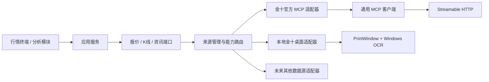

# 架构设计

## 目标

同一种数据允许由不同数据源提供；增加或替换提供方时，领域模型和分析算法不发生修改。数据源原始字段只能存在于适配器层，进入应用层之前必须完成标准化并携带来源信息。

## 分层

1. `domain`：品种、报价、K线、快讯、文章、财经事件和来源元数据。不得依赖网络库或提供方字段。
2. `application`：按能力拆分的数据端口，以及按优先级切换提供方的服务。
3. `infrastructure.mcp`：标准 MCP 生命周期、JSON-RPC、HTTP/SSE、会话和错误模型。
4. `application.sources`：按能力、启用状态和优先级选择来源，支持本地优先、自动回退和强制来源。
5. `infrastructure.providers.jin10`：代码映射、金十结构化结果校验与领域对象转换。
6. `infrastructure.providers.jin10_desktop`：Windows 窗口发现、截图、OCR 和安全范围校验。
7. `web`：只调用本地 API，不持有 Bearer Token，也不解析供应商原始响应。
8. `analysis`：未来的指标、特征、信号和回测。只消费领域对象。

## 多数据源约束

- 用领域品种标识表达资产，提供方代码由各适配器映射。
- 每条记录保留 `provider`、`provider_symbol`、源时间和本地接收时间。
- 回退链只捕获明确的提供方错误；编程错误不得被静默吞掉。
- 强制来源不会回退；自动来源才按优先级尝试后续提供方。
- 来源能力显式声明。报价源不具备 K 线能力时，路由器不会假装能够提供。
- 缓存、限流、持久化作为装饰器或独立端口，不写进分析算法。
- 原始响应可用于审计，但不能成为跨模块契约。

## 首版范围

- 用官方 MCP 和本地桌面 OCR 两套来源接入 `XAUUSD` 与 `XAGUSD`，验证通用采集链路。
- 暂不实现黄金期货交易信号，因为还缺少具体期货合约、交易所、连续合约/换月规则和分析周期的定义。
- 后续接入期货源时复用同一报价/K线端口，并新增合约与期限结构模型。
