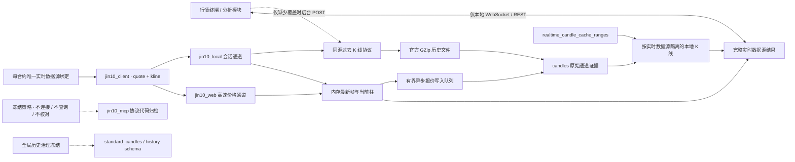

# 架构设计

## 目标

平台允许存在多个实时数据源，但一个合约只能绑定其中一个。完整实时数据源同时提供 `quote + kline`；报价、当前柱、过去柱、分时、状态和延迟都服从同一绑定。“历史数据”仅表示当前时刻之前的数据，不等同于 K 线。独立的全局历史治理当前冻结。

## 实时性第一原则

- 准确性是前置门槛：只接收带明确品种、来源时间和本地接收时间的结构化数据，不用截图、OCR 或推测值补齐。
- 推送源的数据帧一旦完成校验和领域映射，必须在同一事件循环轮次内广播；数据库写入通过有界队列异步完成，不能阻塞页面。
- 实时报价查询和 WebSocket 首帧只读内存热缓存或 PostgreSQL `latest_quotes`，不得因页面打开、刷新或新增订阅者而调用上游。
- 采集生命周期只由合约的实时数据源路由决定。实时数据源再把订阅需求映射到内部通道；浏览器不能直接选择通道。
- 上游推送间隔、网络往返和官方额度属于外部约束，必须单独展示；不得再叠加保守轮询、批次串行、长重连退避或全量重复绘图。

## 分层

1. `domain`：品种、报价、K线、快讯、文章、财经事件和来源元数据。不得依赖网络库或提供方字段。
2. `application`：按能力拆分的数据端口、完整实时数据源校验、每合约唯一路由、聚合报价视图、同源 K 线和持续报价事件。
3. `infrastructure.mcp`：历史实现归档；应用运行时不读取其配置、不实例化客户端，也不把它注册成任何来源。
4. `application.sources`：严格区分可选实时数据源与内部采集通道；可选源必须声明报价与 K 线两项能力。
5. `infrastructure.providers.jin10`：代码映射、金十结构化结果校验与领域对象转换。
6. `infrastructure.postgres`：实时数据源路由、分渠道报价追加、最新值原子更新、同源 K 线证据和完成覆盖范围；旧标准历史结构冻结保留。
7. `infrastructure.providers.jin10_local`：本机会话解析、报价/K 线协议、历史文件下载、心跳与断线重连。
8. `infrastructure.providers.jin10_web`：官网公开报价协议、变化驱动订阅、心跳响应和快速重连。
9. `web`：按合约连接本地 API/WebSocket，不持有 Bearer Token 或本地会话令牌；同秒多帧以接收时间保持顺序并全部参与当前柱计算。
10. `analysis`：未来的指标、特征、信号和回测。只消费领域对象。

## 多数据源约束

- 用领域品种标识表达资产，提供方代码由各适配器映射。
- 每条记录保留 `provider`、`provider_symbol`、源时间和本地接收时间。
- `instrument_source_routes` 用 `instrument_symbol` 唯一索引保证每个合约最多一条 `realtime` 绑定。旧版 `quote` 路由迁移为 `realtime`；内部通道或 MCP 绑定统一迁移为默认实时数据源。
- REST/WebSocket 不接受来源参数，只按合约绑定读取；`auto`、内部通道 ID 和未注册实时数据源都不能成为路由。绑定源不可用时只停滞对应合约，不静默换源。
- 原始层严禁混合渠道：`jin10_web` 与 `jin10_local` 各自追加、缓存和审计。历史遗留的 `jin10_mcp` 原始记录只作审计归档，不进入实时、校对或标准历史；`jin10_client` 只存在于路由和聚合查询层，不写入原始行情表。
- 组合字段归属固定：`last/change/change_percent` 只能来自 `jin10_web`；`open/high/low/volume` 只能来自 `jin10_local`。价格通道失败时组合报价停滞，补充通道失败时字段标记缺失或过期，均不静默代替。
- K 线 GET 先解析合约绑定，只合并该实时数据源声明的过去 K 线通道、实时价格通道与内存当前柱；返回结果统一标记为绑定源，内部通道身份只保留在数据库审计层。
- 缺失范围只能由独立回补 POST 触发。它使用同一绑定源的历史能力，先检查 `realtime_candle_cache_ranges`，再下载、校验并写入 `candles`；GET 本身永不访问上游。成功零行也记录覆盖，失败不记录。
- 图表只把用户在分时或任意 K 线周期到达左边界的交互转换为更早窗口回补；程序性视窗变化不触发。回补完成后按精确前插点数平移逻辑范围，保持用户正在查看的位置。
- 当前分钟优先由内存同源报价即时更新；数据库异步落盘不会阻塞当前柱。读取时只合并同一来源、同一分钟的数据库证据与内存状态。
- `standard_candles`、`candle_validation_results` 和独立 `history` schema 仅作冻结资产保留；运行时不读、不写、不回填，也不把其他来源的数据补进绑定源。
- 报价先进入内存事件通道，数据库通过有界队列异步落盘。
- `jin10_local` 与 `jin10_web` 都是内部事件推送通道，不是两个实时数据源。`jin10_mcp` 的请求式能力代码保留但当前全面冻结：不注册、不启用、不测试，也不参与过去数据补取或校对。
- 原始响应可用于审计，但不能成为跨模块契约。

## 首版范围

- `jin10_client` 是首个可选实时数据源；`jin10_local` 与 `jin10_web` 只作为其内部采集和可审计原始通道保留。每个合约只选择一个实时数据源，不直接选择通道，也不做实时或过去数据的静默换源。
- 暂不实现黄金期货交易信号，因为还缺少具体期货合约、交易所、连续合约/换月规则和分析周期的定义。
- 后续接入期货源时复用同一报价/K线端口，并新增合约与期限结构模型。
