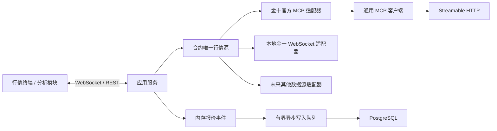

# 架构设计

## 目标

同一种数据允许由不同数据源提供；来源配置的键是“合约”，不是全局开关，也不是按数据能力拆分。同一合约的报价、K 线、分时和状态只绑定一个明确来源，失效时发布不可用状态，不静默切换或混用。

## 实时性第一原则

- 准确性是前置门槛：只接收带明确品种、来源时间和本地接收时间的结构化数据，不用截图、OCR 或推测值补齐。
- 推送源的数据帧一旦完成校验和领域映射，必须在同一事件循环轮次内广播；数据库写入通过有界队列异步完成，不能阻塞页面。
- 最新报价和最新 K 线不得被 TTL 缓存拦截。缓存只允许覆盖已经闭合、不会再变化的历史区间。
- 请求式来源首次进入页面时立即调用；周期请求按数据自然边界调度，并按“计划开始时间”而不是“上次请求结束时间”计算下一次调用，避免网络耗时叠加为客户端漂移。
- 上游推送间隔、网络往返和官方额度属于外部约束，必须单独展示；不得再叠加保守轮询、批次串行、长重连退避或全量重复绘图。

## 分层

1. `domain`：品种、报价、K线、快讯、文章、财经事件和来源元数据。不得依赖网络库或提供方字段。
2. `application`：按能力拆分的数据端口、显式来源校验和持续报价事件。
3. `infrastructure.mcp`：标准 MCP 生命周期、JSON-RPC、HTTP/SSE、会话和错误模型。
4. `application.sources`：校验具体来源、能力与启停状态，不执行候选链回退。
5. `infrastructure.providers.jin10`：代码映射、金十结构化结果校验与领域对象转换。
6. `infrastructure.postgres`：来源路由、报价追加、最新值原子更新和 K 线幂等写入。
7. `infrastructure.providers.jin10_local`：本机会话解析、行情协议、长连接、心跳与断线重连。
8. `web`：按合约连接本地 API/WebSocket，不持有 Bearer Token 或本地会话令牌。
9. `analysis`：未来的指标、特征、信号和回测。只消费领域对象。

## 多数据源约束

- 用领域品种标识表达资产，提供方代码由各适配器映射。
- 每条记录保留 `provider`、`provider_symbol`、源时间和本地接收时间。
- `instrument_source_routes` 暂保留旧表结构以兼容现有数据库，但应用会将同一合约的报价与 K 线行原子写成同一个来源；不同合约互不影响。
- `auto` 被拒绝；来源不可用时只停滞绑定它的合约。
- 来源能力显式声明。不能同时提供报价与 K 线的来源不能被选为完整行情源；系统不会借用其他来源补足。
- 报价先进入内存事件通道，数据库通过有界队列异步落盘。
- `jin10_local` 是事件推送源，不经过定时轮询；`jin10_mcp` 是请求式来源，调用立即发出并受官方每日额度约束。
- 原始响应可用于审计，但不能成为跨模块契约。

## 首版范围

- `jin10_mcp` 提供官方报价、K 线和财经内容；`jin10_local` 已提供现货黄金、现货白银的本地会话结构化报价，并由同一数据流生成分钟 K 线。
- 暂不实现黄金期货交易信号，因为还缺少具体期货合约、交易所、连续合约/换月规则和分析周期的定义。
- 后续接入期货源时复用同一报价/K线端口，并新增合约与期限结构模型。
