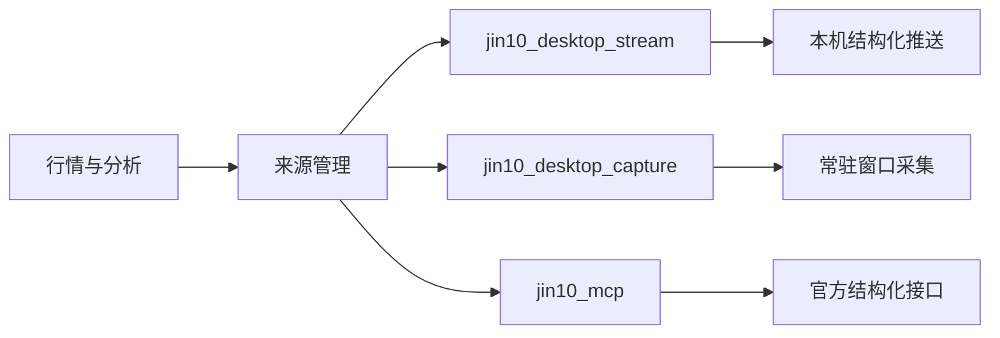

# 本地金十数据加速路线

## 已确认的现状

2026-08-06 对本机安装版本做了只读检查：

- 主界面是 Flutter，进程同时启动了 CEF 的 GPU、存储和网络子进程；
- Windows UI Automation 只能看到一个 `FLUTTERVIEW` 容器，看不到黄金、白银或价格文本，因此不能用无障碍树替代 OCR；
- 应用存在持续网络连接和本地监听端口，但这些端口不是可直接读取的普通 HTTP 行情接口；
- 安装资源能确认金十站点域名，尚未发现可直接复用、无需会话的公开实时报价端点；
- 当前采集每次都会启动 PowerShell、重新加载 Win32/WinRT 类型、截整窗、写临时 PNG、初始化 OCR，并且黄金与白银分别重复一次；
- 窗口最小化时 `PrintWindow` 采集不可用，被其他窗口遮挡不影响。

窗口恢复后的一次基线采样中，黄金脚本约 `551ms`、白银约 `530ms`，两个品种顺序读取约 `1.08s`；经当前后端完成一次本地连接测试约 `772ms`。这是单次现场测量，不是 P95 性能数据，但足以说明 1 秒级轮询若继续反复启动 PowerShell 会带来明显的进程和 CPU 开销。

因此最优先的加速点不是提高页面轮询频率，而是先把采集器改成长驻、内存内、一次采两种报价的本地服务。

## 路线优先级

| 优先级 | 路线 | 预期收益 | 风险与限制 |
| --- | --- | --- | --- |
| P0 | 常驻原生采集器 | 把 5 秒采样推进到约 0.5–1 秒，且不增加官方额度 | 仍要求窗口不最小化；需要做 DPI 和布局校准 |
| P1 | CEF DevTools / WebSocket 帧检查 | 若行情来自嵌入页，可直接获得结构化推送 | 应用未必开放调试端口，版本升级可能变化 |
| P2 | 进程级代理或 TLS 会话解码 | 可识别真实上游接口、订阅消息和字段协议 | 涉及会话与敏感数据，需确认服务条款并严格隔离凭据 |
| P3 | 解密边界动态 Hook | 在代理或证书固定阻塞时仍可能看到明文帧 | 脆弱、维护成本高，只适合短期可行性研究 |
| P4 | 授权 WebSocket 行情源 | 真正逐笔或秒级、稳定且可审计 | 有持续授权费用 |

## P0：推荐立即实施的常驻采集器

新建 `jin10_desktop_capture` 适配器背后的常驻 Windows 采集服务，保留现有 `QuoteProvider` 契约：

1. 进程启动时只初始化一次窗口句柄、截图资源和 OCR 引擎；句柄失效时再重新发现；
2. 每次只取一个窗口帧，同时裁剪黄金和白银区域，避免两次整窗截图；
3. 位图全程留在内存，不生成临时 PNG；
4. 先对价格区域做像素哈希，画面未变化时不运行 OCR；
5. 使用专门的数字识别或复用单个 Windows OCR 引擎，并保留小数位、合理区间和跳变检查；
6. 通过仅监听 `127.0.0.1` 的 WebSocket/SSE 推送标准化报价，Web 端不再固定轮询截图脚本；
7. 同时输出采集耗时、识别耗时、帧龄、错误状态和最近成功时间，来源管理页继续负责测试和切换。

第一阶段验收目标：0.5–1 秒采样、端到端 P95 小于 1 秒、连续运行 2 小时无句柄/位图泄漏、错误价格不会发布。目标需要用真实窗口恢复后的基准测试校准，不作为当前实现的既成性能承诺。

## P1/P2：直接解码本地数据链路

按侵入性由低到高验证：

1. 尝试以独立调试端口启动 CEF，使用 DevTools Network 面板观察 Fetch/XHR/WebSocket；这是最容易保留消息边界和字段名的方式；
2. 若 CEF 遵循进程启动参数，给单独的测试实例设置进程级代理，通过 mitmproxy/Fiddler 观察流量；不能修改全机代理，也不能把登录 Cookie、Token 或报文提交到仓库；
3. 原始封包工具（pktmon/Wireshark）先用于确认目标域名、连接生命周期和消息频率。HTTPS/WSS 下仅抓包通常只有密文，不能直接获得价格；
4. 若 CEF 构建支持 TLS key log，可在隔离测试实例中导出临时会话密钥供 Wireshark 解码，使用后立即删除；
5. 只有上述方式都失败且服务条款允许时，才评估在本进程的 TLS/WebSocket 解密边界做动态 Hook。该结果必须封装为 `jin10_desktop_stream` 独立适配器，不能污染领域模型或 OCR 回退源。

停止条件：需要绕过登录/付费权限、破坏证书固定、规避访问控制，或消息协议明显包含账号专属授权时，不继续技术绕过，改用授权推送接口。

## 接入后的来源结构

推荐优先级是 `stream → capture → mcp`。任何新来源都必须输出同一领域报价、携带源时间和本地接收时间，并通过健康检查、去重、乱序处理与价格安全范围校验。
