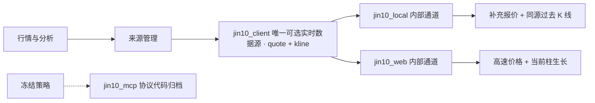

# 本地金十数据加速路线

## 已确认的现状

2026-08-06 对本机安装版本做了只读检查：

- 主界面是 Flutter，进程同时启动了 CEF 的 GPU、存储和网络子进程；
- Windows UI Automation 只能看到一个 `FLUTTERVIEW` 容器，看不到结构化行情字段；
- 应用存在持续网络连接和本地监听端口，但这些端口不是可直接读取的普通 HTTP 行情接口；
- 已从金十官网公开报价插件确认 `wss://b-price.jin10.com/` 的结构化协议，并完成独立适配；
- `flutter_kline` 存在 GZip 压缩的固定 48 字节 K 线记录；现已确认每条依次为 Unix 秒时间和 `high/open/low/close/volume` 六个小端 int64，价格缩放为 `10^-6`。它是过去 K 线缓存，不是实时 tick；
- 截图识别曾把约 4264 的黄金价格误读为 426.74，已证明不满足行情事实数据要求。
- 已定位本地会话中的 36 位令牌，并完成金十行情 WebSocket 的握手、异或解码、登录、报价/K 线订阅、心跳及帧解析；
- 已还原同一会话的首次 K 线、实时 K 线、历史文件目录和向前分页协议；历史文件从金十官方文件服务下载并按固定记录结构校验；
- 已实测 `XAUUSD.GOODS` 与 `XAGUSD.GOODS` 在同一长连接内持续推送，通常约 3～4 秒一帧。
- 已实测公开网页通道的变化驱动档：黄金 28 秒 71 帧，常见约 0.1～0.4 秒一帧；黄金与白银可在同一连接订阅。

因此截图和 OCR 不属于后续路线，也不作为任何兜底。生产来源只接受具有明确字段、时间戳和来源标识的结构化数据。

## 已落地的数据链路

`jin10_local` 使用一个只驻留后端内存的桌面会话快照。显式 `JIN10_LOCAL_SESSION_TOKEN` 优先；macOS 标准安装未配置覆盖值时，从当前用户的 `~/Library/Application Support/com.jin10.desktop/local_storage.json` 读取顶层 `ji10_token`。协议已实测支持以 `user_id=0` 让服务端从 token 解析账户，因此运行链路不读取诊断日志，也不保存用户编号。Windows 与 Linux 只需显式 Token。自动发现拒绝符号链接、目录外文件和非当前用户所有的文件。适配器直接连接行情 WebSocket，以 1000ms 的最低订阅档请求行情，输出当前价、买卖价、成交量、开高低、昨收、源时间和本地接收时间。解码完成后在同一事件循环轮次内直接广播，不再经过 0.5 秒轮询；数据库写入在独立有界队列中完成。它维护 10 秒心跳并在断线后以 0.1～1 秒快速退避重连，不需要截图，也不调用官方 MCP。

`jin10_web` 是另一条独立内部通道，按金十官网公开插件的二进制协议连接网页报价服务器，默认请求 `frequency=0` 的价格变化推送。它只提供当前价、昨收与源时间，不伪造开高低等未下发字段。两条通道在采集和原始落库层保持独立，但共同组成 `jin10_client` 实时数据源；合约不能直接选择其中任一通道。

过去 K 线回补使用同一个 `jin10_local` 会话：订阅 `time_type=1` 的分钟 K 线，协议 `10006` 以目标缺失窗口的结束时间作为边界，直接请求该边界之前的历史文件目录，再从官方文件服务下载 GZip 数据；不再从最新目录反复向前翻页。页面 K 线 GET 始终只读本地；仅在 PostgreSQL 没有该范围的永久覆盖时，后台普通回补命令才访问上游。相同范围及模式的并发请求精确合并，重叠窗口只下载未覆盖差集，全局历史下载并发默认限制为 2；失败按指数退避，不能阻塞报价、当前 Bar 或 WebSocket。

小时、日、周等派生周期不会在每次 GET 时反复聚合整段分钟历史。`POST /api/bars/{code}/history` 在完成必要的同源回补后，于服务端增量物化所需周期页并直接返回；普通 GET 只读取当前物化页，实时尾部变更只读覆盖受影响桶。事实层若插入了物化边界之前的更早 Bar，物化进度会重新开放并从新增范围继续向前推进，重复请求不重新访问金十，也不重复计算已经确认的桶。

每个成功批次返回实际检查范围、排他 `authoritative_through`、证据版本和可选 `history_floor`。原始 Candle、统一 Bar、合并后的永久覆盖与 `realtime_bar_series_state` 在一个短 PostgreSQL 事务中提交，之后才发布内存历史；成功但零行的休市范围也缓存，失败和取消不写状态。当前仍可追加的尾部只做有冷却的软检查，实时权威水位推进后自动解除冷却。一个空窗口不能推导 `history_floor`。

当前交易日文件可以在相同文件标识下追加，因此下载使用 `record_count + end_timestamp` 作为 manifest 版本键；本地缓存必须完整覆盖 manifest 声明区间才可复用，文件尾部后来追加的真实 Bar 不构成计数错误。若图表随后在同一交易时段内观察到具体 Bar 缺口，可以按证据版本和冷却只复核该精确子区间；该复核不跨来源，也不会把跨会话休市扩展成分钟请求。

若稳定 manifest 版本请求仍命中旧 CDN 副本，后端会使用唯一刷新参数再下载一次；第二次仍不覆盖声明区间才失败，不把瞬时缓存不一致留给页面重复请求。

金十软件只需至少登录一次以生成有效会话 token。项目连接建立后不要求软件窗口持续运行；启动时暂时没有会话也不会移除历史能力，后端会继续探测，重新登录后自动恢复连接和待处理补数。macOS 轮换后的 Token 可自动生效；显式环境 Token 变更后需要重启后端。凭据不得提交、复制、打印、写入数据库或通过诊断接口返回。

统一恢复协调器在启动时审计最近七天的统一一分钟序列，并从持久化权威水位追赶到当前已完成分钟；实时连接恢复后的首个事件也进入同一流程。交易日历先排除维护、午休与周末，再合并真正缺口。补数仍由合约绑定的数据源完成，历史批次、永久覆盖和权威水位原子提交；已确认的有数据或零数据区间都不会重复访问上游。三分钟及以上周期统一从修复后的一分钟事实层增量物化。

## 后续路线优先级

| 优先级 | 路线 | 预期收益 | 风险与限制 |
| --- | --- | --- | --- |
| 已完成 | 本机会话 WebSocket 协议适配 | 结构化实时报价、零 MCP 调用 | 客户端或协议升级后需重新验证 |
| 已完成 | 官网公开 WebSocket 协议适配 | 变化驱动的高频结构化报价、无需会话 | 公开前端接口无正式 SLA，升级后需重新验证 |
| 已完成 | 同源 K 线协议、历史文件与 PostgreSQL 覆盖缓存 | 扩展 `jin10_client` 自身的过去数据覆盖；重复范围零上游请求 | 只接纳固定内部通道数据；协议升级后需重新验证 |
| P2 | 进程级代理或 TLS 会话解码 | 可识别真实上游接口、订阅消息和字段协议 | 涉及会话与敏感数据，需确认服务条款并严格隔离凭据 |
| P3 | 解密边界动态 Hook | 在代理或证书固定阻塞时仍可能看到明文帧 | 脆弱、维护成本高，只适合短期可行性研究 |
| P4 | 授权 WebSocket 行情源 | 真正逐笔或秒级、稳定且可审计 | 有持续授权费用 |

## 直接解码本地数据链路

按侵入性由低到高验证：

1. 尝试以独立调试端口启动 CEF，使用 DevTools Network 面板观察 Fetch/XHR/WebSocket；这是最容易保留消息边界和字段名的方式；
2. 若 CEF 遵循进程启动参数，给单独的测试实例设置进程级代理，通过 mitmproxy/Fiddler 观察流量；不能修改全机代理，也不能把登录 Cookie、Token 或报文提交到仓库；
3. 原始封包工具（pktmon/Wireshark）先用于确认目标域名、连接生命周期和消息频率。HTTPS/WSS 下仅抓包通常只有密文，不能直接获得价格；
4. 若 CEF 构建支持 TLS key log，可在隔离测试实例中导出临时会话密钥供 Wireshark 解码，使用后立即删除；
5. 只有上述方式都失败且服务条款允许时，才评估在本进程的 TLS/WebSocket 解密边界做动态 Hook。结果必须封装为 `jin10_local` 独立适配器。

停止条件：需要绕过登录/付费权限、破坏证书固定、规避访问控制，或消息协议明显包含账号专属授权时，不继续技术绕过，改用授权推送接口。

## 接入后的来源结构

每个合约只允许绑定一个实时数据源。当前只有 `jin10_client` 可选；`jin10_local`、`jin10_web` 和未来的其他采集方式必须封装在某个实时数据源内部，不能直接进入合约路由。任何新实时数据源都必须同时提供报价和 K 线；任何新内部通道都必须携带源时间和本地接收时间，并通过健康检查、去重和乱序处理。断线或过去数据缺失时不得静默切换实时数据源、跨源补齐或填充截图值。
